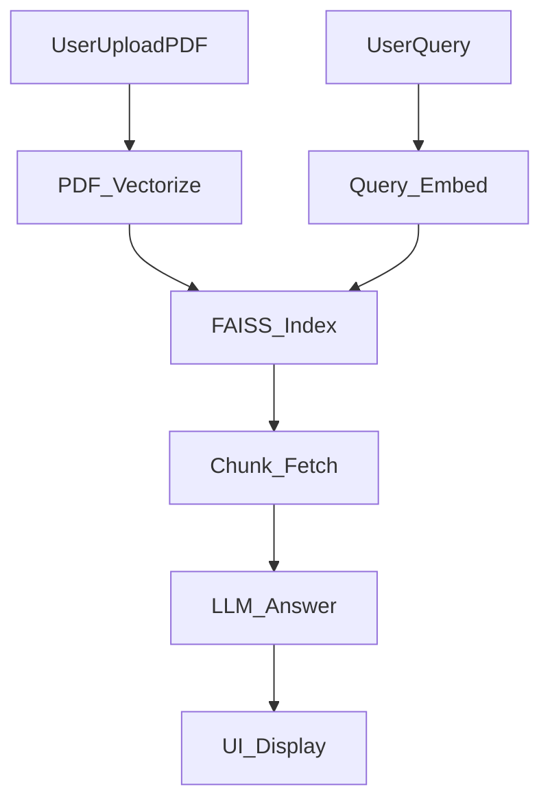

## PDF Chat App with RAG, FAISS, and Groq LLM

An interactive, privacy-focused PDF chat and retrieval-augmented generation (RAG) system, built using Streamlit, FAISS, Sentence Transformers, and Groq LLMs. Instantly query any PDF you upload, get answers with page-level citations, and reference tracked sources—no external API for embeddings required.[1][2][3]

***

### Features

- **Chat with Your PDFs:** Interactive Q&A with any PDF, with pixel-perfect citations.
- **Local Embeddings:** Uses local `sentence-transformers`; no sensitive data leaves your computer.
- **Semantic Search:** FAISS-powered, scalable document chunk retrieval.
- **Groq LLM Integration:** Streamlined, reliable answers with state-of-the-art language models.
- **Reference Links:** Cites all page references for transparency.
- **Modern Streamlit UI:** Chat interface, document upload, history management.[1]

***

### Project Structure

| File                | Purpose                                                                        |
|---------------------|--------------------------------------------------------------------------------|
| `streamlit_rag_app.py` | Streamlit UI: manages chat, document load, config, and serves as frontend orchestrator[1] |
| `pdf-vector.py`     | Back-end: converts PDF to chunks, generates embeddings, builds FAISS index[1][3]      |
| `question-vector.py`| Dev/CLI Q&A: runs semantic retrieval and LLM completion via terminal[1][2]           |
| `vectors.index`     | FAISS vector store (generated by `pdf-vector.py`)[1][3]                              |
| `chunks.pkl`        | Pickle file with text & metadata (generated)[1][3]                                   |

***

### High-Level Architecture & Flow

### System Flow (Mermaid)

**Legend:**

| Node          | Description                           |
|---------------|--------------------------------------|
| UserUploadPDF | User uploads or selects PDF           |
| PDF_Vectorize | PDF is chunked/embedded with vectors  |
| FAISS_Index   | Vectors stored in FAISS index         |
| UserQuery     | User enters query                     |
| Query_Embed   | Query is embedded into vector space   |
| Chunk_Fetch   | Top-K similar chunks are retrieved    |
| LLM_Answer    | Chunks & query sent to Groq LLM       |
| UI_Display    | Answer and citations shown in UI      |

### Component & Flow Breakdown

#### 1. **PDF Processing & Vectorization (`pdf-vector.py`)**
   - Extracts page text via PyPDF2.
   - Chunks text and estimates page numbers.
   - Generates dense embeddings using sentence-transformers (`all-MiniLM-L6-v2`).
   - Indexes embeddings with FAISS (`.index` for vectors, `.pkl` for text/meta).
   - Only needs to be run once per PDF.[3][1]

#### 2. **Semantic Q&A (`question-vector.py` or Streamlit)**
   - Loads FAISS and chunk data.
   - Embeds user query.
   - Retrieves most relevant text chunks/pages (top-k) via inner product similarity.
   - Forwards context plus user prompt to Groq LLM.
   - Cites page numbers and produces concise, referenced answers.[2][3][1]

#### 3. **Web App Interface (`streamlit_rag_app.py`)**
   - **Sidebar:** API key entry, PDF upload, config.
   - **Main area:** Chat interface, history, source highlighting, references.
   - **Backend:** Handles PDF upload or default load, runs chunking/indexing, manages user state/session, forwards queries, handles responses, citations, and UI updates.
   - **Dev/CLI mode:** You can use the command line for direct Q&A (helpful for debugging).[1]

***

### End-to-End Usage Flow

1. **PDF Upload/Selection:** User uploads a new PDF (or uses default).
2. **Vectorization:** PDF is processed (chunked, embedded, indexed) and supporting files generated if new.
3. **Query:** User enters a question.
4. **Retrieval:** System embeds the question, searches FAISS, and fetches relevant PDF chunks/pages.
5. **Answer Generation:** Selected chunks and user query are sent with page reference context to Groq’s LLM.
6. **Display:** The answer is displayed, with page-level citations and source references shown in the UI or CLI.[2][3][1]

***

### How to Extend

- **Swap Embedding Model:** Edit code in vectorization/loading scripts.
- **Add More LLMs:** Switch or support multiple OpenAI-compatible API endpoints.
- **Advanced Chunking:** Tune chunk sizes, overlap, or add OCR for scanned PDFs.
- **UI Enhancements:** Integrate dashboards, export answers, support more file types.

***

### License

MIT License.

***

### Author

Developed by Sudhir
